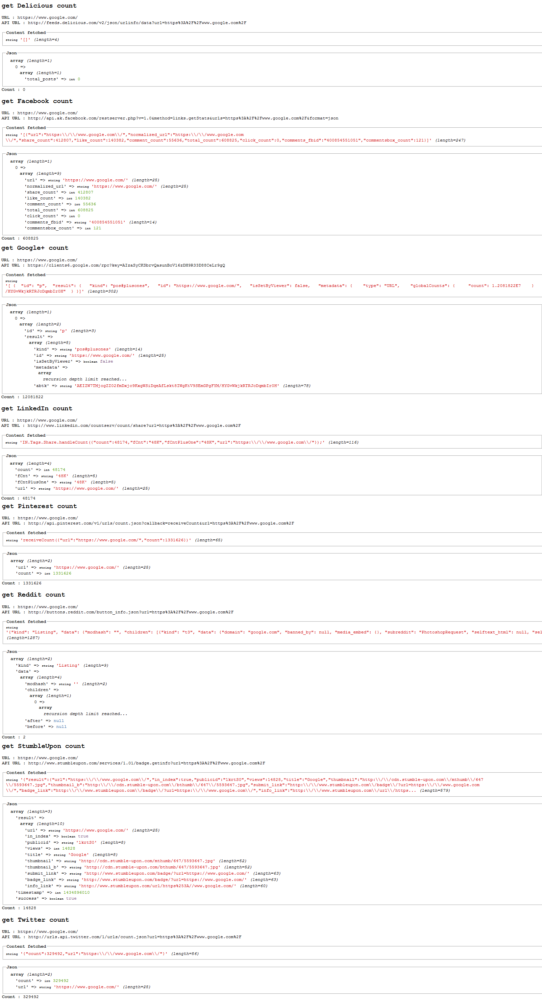

[](https://packagist.org/packages/crazy-max/cws-share-count)
[](https://php.net/)
[](https://travis-ci.org/crazy-max/CwsShareCount)
[](https://www.codacy.com/app/crazy-max/CwsShareCount)
[](https://www.paypal.com/cgi-bin/webscr?cmd=_s-xclick&hosted_button_id=RE9HS4K9ZHC7G)

## About

PHP class to get social share count for Delicious, Facebook, Google+, Linkedin, Pinterest, Reddit, StumbleUpon and Twitter.

## Installation

```bash
composer require crazy-max/cws-share-count
```

And download the code:

```bash
composer install # or update
```

## Getting started

See `tests/test.php` file sample to help you.

## Example



## Methods

**getAll** - Get all social share count.<br />
**getDeliciousCount** - Get delicious social share count.<br />
**getFacebookCount** - Get facebook social share count.<br />
**getGooglePlusCount** - Get google plus social share count.<br />
**getLinkedinCount** - Get linkedin social share count.<br />
**getPinterestCount** - Get pinterest social share count.<br />
**getRedditCount** - Get reddit social share count.<br />
**getStumbleuponCount** - Get stumbleupon social share count.<br />
**getTwitterCount** - Get twitter social share count.<br />
**getError** - Get the last error.

## How can i help ?

All kinds of contributions are welcomed :raised_hands:!<br />
The most basic way to show your support is to star :star2: the project, or to raise issues :speech_balloon:<br />
But we're not gonna lie to each other, I'd rather you buy me a beer or two :beers:!

[](https://www.paypal.com/cgi-bin/webscr?cmd=_s-xclick&hosted_button_id=RE9HS4K9ZHC7G)

## License

MIT. See `LICENSE` for more details.
